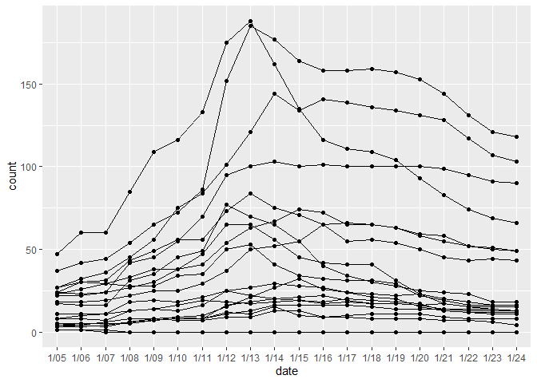
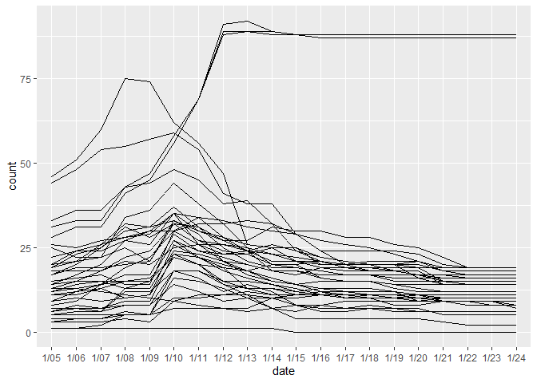

Course Demand & Coursetable Data Guide
================
Daniel Zhao
February 16, 2020

  - [Scraping Course Demand](#scraping-course-demand)
      - [Data source](#data-source)
      - [Dependencies](#dependencies)
      - [Running the script](#running-the-script)
      - [Scraping specific semesters](#scraping-specific-semesters)
      - [How the data is stored](#how-the-data-is-stored)
          - [`courses.csv`](#courses.csv)
          - [`demand.csv`](#demand.csv)
          - [Merging `courses` and
            `demand`](#merging-courses-and-demand)
          - [`subjects.csv`](#subjects.csv)
      - [Working with the data](#working-with-the-data)
          - [Dealing with course codes](#dealing-with-course-codes)
          - [Filtering and graphing:
            example](#filtering-and-graphing-example)
          - [Computing ending enrollment per
            subject](#computing-ending-enrollment-per-subject)
      - [Final comments](#final-comments)
  - [Scraping Coursetable](#scraping-coursetable)
      - [Getting the JSON file](#getting-the-json-file)
      - [Processing the JSON](#processing-the-json)
  - [Merging the two](#merging-the-two)
  - [Existing visualizations](#existing-visualizations)
      - [Course rating and demand
        explorer](#course-rating-and-demand-explorer)
      - [Yale’s Most Popular Courses](#yales-most-popular-courses)
      - [Google Data Studio
        visualizations](#google-data-studio-visualizations)

``` r
knitr::opts_chunk$set(message = F)

library(dplyr)
library(readr)
library(ggplot2)
```

The purpose of this document is to outline existing work, as of February
16, 2010, pertaining to the following:

  - How to scrape Yale Course Demand Statistics using a script we’ve
    written
  - How this data is stored, and how to work with it
  - How to scrape CourseTable
  - Ways to merge the two, and some issues that arise in it
  - Existing visualization and analysis regarding course data

# Scraping Course Demand

The script we use to scrape Yale Course Demand Statistics can be found
at `/projects/courses/scrape_cds_v2.py`.

## Data source

Familiarize yourself with how the Course Demand data is provided by Yale
by viewing them at <https://ivy.yale.edu/course-stats/>. Take note of a
few things:

  - Cross-listed courses appear once in each department in which a
    course is cross-listed
  - Some courses have both an undergraduate and graduate listing in the
    same department
  - Shopping period lasts approximately two weeks
  - There’s data for many departments that don’t offer undergraduate
    courses, which means we’re not interested

## Dependencies

The only dependency that you should install is `BeautifulSoup`, which is
a Python library that parses HTML pages to make them easier to process.
You can install the library by typing the following commands in your
command line (Command Prompt on Windows, Terminal on Mac):

    # if you're using Anaconda
    conda install beautifulsoup4
    
    # if you're using vanilla Python
    pip install beautifulsoup4

## Running the script

You should be able to run the script from your preferred Python
environment. That is, you can open the file in your preferred IDE (such
as Visual Studio Code), run it from the command line, or, if you insist,
copy-and-paste it into a Jupyter Notebook cell to run it there.

We can show you how to use either of the three, but because the script
is fully ready-to-go, it’s easiest to run it from the command line (if
you’re comfortable with that).

Instructions for Windows, assuming you’ve added `python` to your PATH
variables:

  - Open `cmd.exe`
  - Enter `cd [path to the script]`
  - Enter `python scrape_cds_v2.py` and wait for it to scrape\!

There’s an optional command-line argument to specify the semester you
want to scrape. For example, to scrape Fall 2019, you should enter
`scrape_cds_v2.py 201903` instead; see below for explanation semester
codes.

The scraping should take a few minutes, depending on your system and
internet connection; a recent scrape on my computer took 3 minutes, 9.6
seconds. The script will display its progress as it scrapes.

## Scraping specific semesters

By default, the script scrapes the Spring 2020 semester. You can set
another semester to scrape by going to line 32 and changing the
`semester` variable to the semester code for the semester for which you
want to scrape.

The semester code is a six-digit number used by Yale, with the first
four corresponding to the year and the last two corresponding to Spring
(`01`), Summer (`02`), or Fall (`03`). For example:

  - Spring 2020 would be `202001`
  - Fall 2018 would be `201803`
  - Spring 2017 would be `201701`

## How the data is stored

If you look at the data, you’ll find three separate files instead of
one. That seems unintuitive; why could we just have one file with all of
the courses? The reasoning lies in several characteristics inherent to
the data. In this section, I’ll explain some of the choices I had to
make in storing the data.

The simplest way to store the data would to use one row per course, and
one column per day of shopping period. Thus, if a department had fifty
courses offered, and shoppping period lasted for fourteen days, we would
have a \(50 \times 15\) table (fifteen because the first column is the
name of the course).

This presents several issues:

  - **What do we do if a course is cross-listed?** We don’t want the
    same course to be listed twice in the table, because then
    visualizations would have duplicate data points. So we want to make
    sure that a unique given course occupies only one row in the table.
  - **How can we make sure that we can filter courses by department?**
    This problem would be easy if courses weren’t cross-listed, because
    we can just create a new column with the name of the department. But
    since we decided that one unique course should only occupy one row
    in the data no matter how many times it’s cross-listed, which
    department should this new column contain?
  - **How can we make it easier to visualize the data?** While the
    one-row-per-course, one-column-per-day format is intuitive an easy
    to conceptualize, it’s not in the spirit of how most modern data
    visualization tools intake their data. For example, both `ggplot2`
    in R and D3.js, the JavaScript library used to create interactive
    online visualizations, prefer one row *per data point*. What
    constitutes a data point? When you make a line chart of course
    enrollment over fourteen days, \``ggplot2` actually thinks it’s
    plotting *fourteen* data points (one at each day), which means that
    `ggplot2` is looking for fourteen rows of data, not one row with
    fourteen columns.

(For those curious: these issues point pretty naturally to storing data
in *tidy form* or *long form*, instead of *wide form*. More generally,
we’re dancing around the issue of *database normalization*, which you
might have encountered if you’ve ever used SQL. You can read more about
tidy data [here](https://r4ds.had.co.nz/tidy-data.html).)

The solution is to these issues is to split the data out into three
tables:

  - `courses.csv`
  - `demand.csv`
  - `subjects.csv`

<!-- end list -->

``` r
courses <- read_csv("courses.csv")
demand <- read_csv("demand.csv")
subjects <- read_csv("subjects.csv")
```

### `courses.csv`

Let’s start with `courses.csv`, which contains *one row per course
code*:

``` r
courses
```

    ## # A tibble: 3,325 x 3
    ##       id code     name                          
    ##    <dbl> <chr>    <chr>                         
    ##  1     1 ACCT 270 FoundationsAccountng&Valuation
    ##  2     2 AFAM 146 Urban and Education Inequality
    ##  3     2 ECON 171 Urban and Education Inequality
    ##  4     2 EDST 271 Urban and Education Inequality
    ##  5     3 AFAM 162 AfricanAmerHist:Emanciptn-Pres
    ##  6     3 AMST 162 AfricanAmerHist:Emanciptn-Pres
    ##  7     3 HIST 187 AfricanAmerHist:Emanciptn-Pres
    ##  8     4 AFAM 164 "Politics of \"The Wire\""    
    ##  9     4 PLSC 263 "Politics of \"The Wire\""    
    ## 10     4 URBN 304 "Politics of \"The Wire\""    
    ## # ... with 3,315 more rows

You’ll see that:

  - Each *unique course code* gets one row in the table, even courses
    that are cross-listed
  - When courses are cross-listed, they get separate rows for each
    course code, but they share the `name`
  - When courses are cross-listed, all listings for the same course get
    the same `id`

### `demand.csv`

This file contains the bulk of the demand data. Here’s what it looks
like:

``` r
demand[1:10, ]
```

    ## # A tibble: 10 x 3
    ##       id date  count
    ##    <dbl> <chr> <dbl>
    ##  1     1 1/05     22
    ##  2     1 1/06     22
    ##  3     1 1/07     24
    ##  4     1 1/08     42
    ##  5     1 1/09     45
    ##  6     1 1/10     55
    ##  7     1 1/11     70
    ##  8     1 1/12     95
    ##  9     1 1/13    100
    ## 10     1 1/14    103

Here’s another section of the data:

``` r
demand[1236:1245, ]
```

    ## # A tibble: 10 x 3
    ##       id date  count
    ##    <dbl> <chr> <dbl>
    ##  1    65 1/20      7
    ##  2    65 1/21      7
    ##  3    65 1/22      7
    ##  4    65 1/23      7
    ##  5    65 1/24      6
    ##  6    66 1/05      0
    ##  7    66 1/06      1
    ##  8    66 1/07      1
    ##  9    66 1/08      3
    ## 10    66 1/09      3

Do you see what’s happening? `demand` contains one row per *day* of
shopping period, which means that for each course, there are 20 rows,
since there are twenty days in shopping period. A consequence is that
this makes it super easy to use many visualization tools:

``` r
demand %>%
  filter(id %in% 1:20) %>%
  ggplot(aes(x = date, y = count, group = id)) +
  geom_point() + geom_line()
```

<!-- -->

If you’re familiar with `ggplot`, what’s happening is this: first, it
plots a point at every (`date`, `count`) observation in the table. Then,
it connects all the dots that have the same `id` variable. This wouldn’t
easily be possible had we stored our data in *wide* format, with one row
per course and one column per day of shopping period, and it’d require
some more intensive data reshaping. This format might seem uninituitive
at first, but it makes plotting in `ggplot` and in D3.js (the online
visualization tol) much easier that it’s worth the additional upfront
complexity.

What’s the `id` variable doing here, and what does the `id` correspond
to? Turns out that this `id` variable is the same as the `id` in the
`courses` table we looked at earlier\! So `id = 1` corresponds to ACCT
270, Foundations of Accounting & Valuation from the first table above.

### Merging `courses` and `demand`

At this point you might ask how we can match courses from the `demand`
table to those in the `courses` table. Those familiar with database
operations will know that we’ll use a `join`, whereby we match rows in
one table to rows in another. Here’s a basic example, using the
`left_join()` function in `dplyr`:

  - We take the first table (known as the “left table”), which is
    `courses`
  - Then we look at the second table (known as the “right table”), which
    is `demand`
  - Using any columns in common, which in this case is `id`, we match
    rows, duplicating rows as necessary

Note that last point: in the left table, we used to have one row per
`id`, but in the right table, we had twenty rows per `id`, so the
`left_join()` operation duplicated the rows on the left until we have
one row per `date` of shopping period.

``` r
left_join(courses, demand)
```

    ## # A tibble: 66,500 x 5
    ##       id code     name                           date  count
    ##    <dbl> <chr>    <chr>                          <chr> <dbl>
    ##  1     1 ACCT 270 FoundationsAccountng&Valuation 1/05     22
    ##  2     1 ACCT 270 FoundationsAccountng&Valuation 1/06     22
    ##  3     1 ACCT 270 FoundationsAccountng&Valuation 1/07     24
    ##  4     1 ACCT 270 FoundationsAccountng&Valuation 1/08     42
    ##  5     1 ACCT 270 FoundationsAccountng&Valuation 1/09     45
    ##  6     1 ACCT 270 FoundationsAccountng&Valuation 1/10     55
    ##  7     1 ACCT 270 FoundationsAccountng&Valuation 1/11     70
    ##  8     1 ACCT 270 FoundationsAccountng&Valuation 1/12     95
    ##  9     1 ACCT 270 FoundationsAccountng&Valuation 1/13    100
    ## 10     1 ACCT 270 FoundationsAccountng&Valuation 1/14    103
    ## # ... with 66,490 more rows

For those familiar with database operations and SQL, these are your
typical SQL joins; we’ll mostly be using left joins and inner joins.
You’ll also recognize that the considerations we talked about earlier
are just a matter of achieving somewhere around third normal form, or
3NF. (No worries if that doesn’t mean anything to you\!)

**For those unfamiliar with joins, you should read up on [relational
data and joins here](https://r4ds.had.co.nz/relational-data.html). We’ll
use joins a lot for the YDN Data Desk, not just for the `demand` and
`courses` tables but also to merge in CourseTable data, so it’s a good
idea to wrap your head around what the computer is doing when you tell
it to join rows.** Joins aren’t just useful for course-related datasets:
a lot of the Data Desk’s work will involve combining disparate datasets,
so being comfortable joins will be an important skill.

At this point, it might also be clearer how we’ve dealt with the three
issues we described at the beginning of this section. Here were the
three issues, and here’s how we’ve dealt with them:

  - **Cross-listing of courses**: to avoid writing duplicate data, the
    `demand` table only contains one set of numbers for each unique
    courses, no matter how often it is cross-listed
  - **Filtering courses by department**: we can start with the `courses`
    table, extract the department code from the entire course code
    (e.g. extracting “AFAM” from “AFAM 270”), then filter from there.
    Since courses that are cross-listed get separate rows, we can filter
    by one department and ensure that we’ve still captured all the
    courses that were ever listed in that department
  - **Easy visualization**: as we demonstrated above, the
    one-row-per-day format makes this easy

### `subjects.csv`

The last table we have is fairly straightforward: it simply includes a
list of the department codes, and the full names of those departments:

``` r
subjects
```

    ## # A tibble: 250 x 2
    ##    subject name                          
    ##    <chr>   <chr>                         
    ##  1 ACCT    Accounting                    
    ##  2 ADSC    Administrative Sciences       
    ##  3 AFAM    African American Studies      
    ##  4 AFAS    African & African-Amer Studies
    ##  5 AFKN    Afrikaans                     
    ##  6 AFST    African Studies               
    ##  7 AKKD    Akkadian                      
    ##  8 AMST    American Studies              
    ##  9 AMTH    Applied Mathematics           
    ## 10 ANES    Anesthesiology                
    ## # ... with 240 more rows

## Working with the data

I tend to use packages from the tidyverse family, so I’ll load those
below. (I could just call `library(tidyverse)` once, although I tend to
avoid doing that in order to minimize cases where functions of the same
name conflict with each other one package will override functions from
the other.)

Side note: the **tidyverse** is a set of R packages that streamline
common data manipulation tasks.Not all R users use the tidyverse, and
you can do anything in the tidyverse without using the tidyverse; using
the core R functionality instead of tidyverse functionality is called
**Base R**. For YDN Data, you can expect to see code written in both
using Base R and in tidyverse, and you can feel free to use whichever
you’re more comfortable with.

``` r
library(readr)
library(dplyr)
library(tidyr)
library(stringr)
library(ggplot2)
```

Reading in the files, which is the same as what we did above:

``` r
courses <- read_csv("courses.csv")
demand <- read_csv("demand.csv")
subjects <- read_csv("subjects.csv")
```

Below, the code that I include will use the `%>%` operator, known as the
pipe. If you’re not familiar with the pipe, you should skim through
[this page](https://r4ds.had.co.nz/pipes.html) to get a basic
understanding of what it is and what it does. You don’t have to write
code using the pipe, but it comes up frequently enough when you search
for help with R code online (such as on Stack Overflow) that it’s
helpful to know what it does.

I also use several functions from `dplyr`, a package designed for data
analysis and manipulation. For now, it suffices to know that there are a
few primary operations from the `dplyr` package:

  - `mutate(df, newCol = oldCol + 2)` creates a new column in `df`
    called `newCol` that adds 2 to `oldCol`
  - `filter(df, oldCol == 2)` filters `df` to only those rows where
    `oldCol` equals 2
  - `select(df, oldCol, newCol, newNewCol)` extracts only those three
    columns in `df`
  - `arrange(df, desc(oldCol))` orders the rows in `df` in descending
    order of `oldCol`
  - Finally, you’ll often see `group_by(df, category)` used in
    conjunction with `summarize(df, meanPerGroup = mean(var))`. This
    chain calculates the mean of `var` for each `category`.

At some point, it might be helpful to read or skim through [this
page](https://r4ds.had.co.nz/transform.html), which is an introduction
to data transformation using `dplyr`, although if the code below doesn’t
seem too difficult to understand, you probably don’t need to bother.

Let’s get to manipulating the data\!

### Dealing with course codes

You’ll find that the `code` column in the `courses` table is actually a
character vector, rather than a numeric. That’s because it contains the
subject code, but also because some courses have an additional letter on
the end, such as “L” for labs and “J” for history seminars. These
functions help us work deal with them; you can feel free to do this
cleaning on your own, or just copy/paste and call these functions:

``` r
unite_code <- function(df) {
    tidyr::unite(df, code, subject, number, sep = " ", remove = FALSE)
}

separate_code <- function(df) {
    tidyr::separate(df, code, into = c("subject", "number"), sep = " ", remove = FALSE)
}

separate_designator <- function(df) {
    num <- df$number
    
    df$number <- as.numeric(str_extract(num, "[[:digit:]]+"))
    df$designator <- str_extract(num, "[:alpha:]")
    
    df
}
```

You can call these functions on the `number` column like so:

``` r
courses <- courses %>% 
  separate_code() %>%
  separate_designator()

courses
```

    ## # A tibble: 3,325 x 6
    ##       id code     subject number name                           designator
    ##    <dbl> <chr>    <chr>    <dbl> <chr>                          <chr>     
    ##  1     1 ACCT 270 ACCT       270 FoundationsAccountng&Valuation <NA>      
    ##  2     2 AFAM 146 AFAM       146 Urban and Education Inequality <NA>      
    ##  3     2 ECON 171 ECON       171 Urban and Education Inequality <NA>      
    ##  4     2 EDST 271 EDST       271 Urban and Education Inequality <NA>      
    ##  5     3 AFAM 162 AFAM       162 AfricanAmerHist:Emanciptn-Pres <NA>      
    ##  6     3 AMST 162 AMST       162 AfricanAmerHist:Emanciptn-Pres <NA>      
    ##  7     3 HIST 187 HIST       187 AfricanAmerHist:Emanciptn-Pres <NA>      
    ##  8     4 AFAM 164 AFAM       164 "Politics of \"The Wire\""     <NA>      
    ##  9     4 PLSC 263 PLSC       263 "Politics of \"The Wire\""     <NA>      
    ## 10     4 URBN 304 URBN       304 "Politics of \"The Wire\""     <NA>      
    ## # ... with 3,315 more rows

Notice that now, the `number` column is a numeric variable, which it
makes it easy to filter courses by course code. For example, we can
filter for labs by looking for “L” in the designator column:

``` r
courses %>%
  filter(designator == "L")
```

    ## # A tibble: 38 x 6
    ##       id code      subject number name                           designator
    ##    <dbl> <chr>     <chr>    <dbl> <chr>                          <chr>     
    ##  1   361 BENG 356L BENG       356 Biomedical Engineering Lab     L         
    ##  2   442 CENG 412L CENG       412 ChemicalEngineering Lab&Design L         
    ##  3   457 CHEM 134L CHEM       134 General Chemistry Laboratory I L         
    ##  4   458 CHEM 136L CHEM       136 GeneralChemistry Laboratory II L         
    ##  5   465 CHEM 222L CHEM       222 Lab for Organic Chemistry I    L         
    ##  6   466 CHEM 223L CHEM       223 Lab for Organic Chemistry II   L         
    ##  7   467 CHEM 251L CHEM       251 Inorganic Chemistry Laboratory L         
    ##  8   469 CHEM 330L CHEM       330 Lab for Physical Chemistry I   L         
    ##  9   470 CHEM 331L CHEM       331 Lab for Physical Chemistry II  L         
    ## 10   472 CHEM 349L CHEM       349 Materials Chemistry Laboratory L         
    ## # ... with 28 more rows

Freshman seminars are numbered 099 and below, so you can filter for
freshman seminars using:

``` r
courses %>%
  filter(number < 100)
```

    ## # A tibble: 55 x 6
    ##       id code     subject number name                           designator
    ##    <dbl> <chr>    <chr>    <dbl> <chr>                          <chr>     
    ##  1    45 AFST 001 AFST         1 Egypt and Northeast Africa     <NA>      
    ##  2    45 ARCG 001 ARCG         1 Egypt and Northeast Africa     <NA>      
    ##  3    45 NELC 001 NELC         1 Egypt and Northeast Africa     <NA>      
    ##  4    46 AFST 028 AFST        28 African Lit in the World       <NA>      
    ##  5    46 ENGL 028 ENGL        28 African Lit in the World       <NA>      
    ##  6    46 LITR 025 LITR        25 African Lit in the World       <NA>      
    ##  7    69 AMST 012 AMST        12 Politcs&Society inUS afterWWII <NA>      
    ##  8    69 HIST 012 HIST        12 Politcs&Society inUS afterWWII <NA>      
    ##  9    70 AMST 028 AMST        28 Book Collecting in America     <NA>      
    ## 10    70 HIST 019 HIST        19 Book Collecting in America     <NA>      
    ## # ... with 45 more rows

### Filtering and graphing: example

Let’s take this further: let’s plot the demand of all freshman seminars
over the course of shopping period. We’ll:

  - Filter for course codes less than 100
  - Take courses with distinct `id`’s, since cross-listed courses are
    listed more than once
  - Merge in demand data
  - Plot the demand per day using `ggplot`

<!-- end list -->

``` r
courses %>%
  filter(number < 100) %>%
  distinct(id, .keep_all = TRUE) %>%
  left_join(demand) %>%
  ggplot(aes(x = date, y = count, group = id)) +
  geom_line()
```

<!-- -->

What’s going on with those courses at the top? Let’s take a look at the
data we used above, and narrow in on only those courses that have that
really high count towards the end. We can do this by looking only at our
final day of enrollment, and filtering to include only those courses
with enrollment greater than 75.

``` r
courses %>%
  filter(number < 100) %>%
  distinct(id, .keep_all = TRUE) %>%
  left_join(demand) %>%
  filter(date == "1/24") %>%
  filter(count > 75)
```

    ## # A tibble: 3 x 8
    ##      id code     subject number name                      designator date  count
    ##   <dbl> <chr>    <chr>    <dbl> <chr>                     <chr>      <chr> <dbl>
    ## 1   640 DRST 002 DRST         2 Directed Studies: Litera~ <NA>       1/24     88
    ## 2   641 DRST 004 DRST         4 Directed Studies: Philos~ <NA>       1/24     87
    ## 3   642 DRST 006 DRST         6 DirectedStud:History&Pol~ <NA>       1/24     87

Ah-ha\! It’s the Directed Studies courses messing up our data, which
means that in the future, if we want to compute any averages on
first-year seminars, we should also take care to filter out courses with
`subject = "DRST"`.

### Computing ending enrollment per subject

As a final example, suppose we want to find out how many students ended
up enrolling in each course, which we can assume is equal to the number
of students for the final day of shopping period. The code below:

  - Starts with the `courses` dataframe
  - Merges in the demand data
  - Makes the `date` column a R date object, instead of a string
  - This allows us to then sort by `date`. Note that the rows are
    already sorted by date (because that’s the way they were scraped),
    but this additional step ensures that it’s in order *just in case*
    something happened
  - Group by `code`. At this point, we have 20 rows per course code (one
    for each day of shopping period), so this command says tht all
    subsequent operations should be completed *per* group of rows
  - For each course (for each group of rows), find:
      - The enrollment (count on the last day of shopping period), which
        is the last row in each group of rows
      - The peak demand, which is the maximum count within each group of
        rows
      - The peak demand day, which is the date corresponding to the day
        on which we saw maximum enrollment

<!-- end list -->

``` r
courses %>%
  left_join(demand) %>%
  mutate(date = as.Date(date, format = "%m/%d")) %>%
  arrange(code, date) %>%
  group_by(code) %>%
  summarize(enrollment = last(count),
            peak_demand = max(count),
            peak_demand_day = date[which.max(count)])
```

    ## # A tibble: 3,250 x 4
    ##    code     enrollment peak_demand peak_demand_day
    ##    <chr>         <dbl>       <dbl> <date>         
    ##  1 ACCT 270         90         103 2020-01-14     
    ##  2 AFAM 146         66         188 2020-01-13     
    ##  3 AFAM 162         49          84 2020-01-13     
    ##  4 AFAM 164        118         185 2020-01-13     
    ##  5 AFAM 172        103         144 2020-01-14     
    ##  6 AFAM 182          0           1 2020-01-05     
    ##  7 AFAM 184          4          15 2020-01-14     
    ##  8 AFAM 186         43          65 2020-01-16     
    ##  9 AFAM 198         49          74 2020-01-15     
    ## 10 AFAM 206         18          77 2020-01-12     
    ## # ... with 3,240 more rows

## Final comments

The point of the three examples above was to give you an idea of how to
work your way around the dataset. It’s a lot of data, and it might be
overwhelming, but with a little bit of flexibility, we know you’ll find
something interesting.

One file that you can use as a starting point, or as a way to see some
additional examples of working with the course demand data, is the code
we used for the **Yale’s Most Popular Courses**. You’ll find a file
named `create_table.R` in `/projects/yale-most-popular-courses/scripts`,
which is the script we ran nightly to find the most up-to-date course
demand patterns. If you think it’ll be helpful, feel free to go through
the script and see if you understand what’s going on.

# Scraping Coursetable

## Getting the JSON file

Believe it or not, it’s substantially easier to get the CourseTable
data, since it doesn’t need to be scraped\! If you look at the source
code for CourseTable by going to the website, right-clicking, and
clicking “View Source” (not through Inspect Element), you’ll find this
code at the very bottom:

    function jsonForSeason(season) {
        return '/GetDataFile.php?season=' + season;
    }

Thus, in order to get the JSON file for a given semester, simply go to
<http://coursetable.com/GetDataFile.php?season=> plus the season of the
semester (YYYYSS, where SS = 03 for fall, 02 for summer, 01 for spring).
This is the same season code as what we described above.

## Processing the JSON

We haven’t done nearly as much working with the JSON yet. You can find a
file called `clean_coursetable.py` that does *very* basic processing on
the raw `coursetable.json` in Python, mostly to extract the only
information that we needed (which was basic course info and meeting
times), and output the `coursetable.csv` file. That code is pretty
self-explanatory.

You can feel free to take the CourseTable data how you want: either
continue working with it in Python, or translate it over to R and
streamline the workflow in R.

# Merging the two

Anytime you’re working with the data and you need to merge them, I
recommend that you start with the following code, or some variation of
it:

``` r
# Libraries -----

library(readr)
library(dplyr)
library(tidyr)
library(stringr)
library(ggplot2)

# Helper functions -----

unite_code <- function(df) {
    tidyr::unite(df, code, subject, number, sep = " ", remove = FALSE)
}

separate_code <- function(df) {
    tidyr::separate(df, code, into = c("subject", "number"), sep = " ", remove = FALSE)
}

separate_designator <- function(df) {
    num <- df$number
    
    df$number <- as.numeric(str_extract(num, "[[:digit:]]+"))
    df$designator <- str_extract(num, "[:alpha:]")
    
    df
}

# Read in data -----

subjects <- read_csv("subjects.csv")

courses <- read_csv("courses.csv") %>%
    separate_code() %>%
    separate_designator() %>%
    select(id, code, subject, number, designator, name)

demand <- read_csv("demand.csv") %>%
    mutate(date = as.Date(date, format = "%m/%d")) %>%
  # merge in course data
    left_join(courses) %>%
    # getting rid of some duplicates: for some reason, certain obscure courses
  # show up more than once. these few lines are just manually getting rid of them
    arrange(code, date, desc(count)) %>%
    group_by(code, date) %>%
    slice(1L) %>%
    ungroup()

coursetable <- read_csv("coursetable.csv") %>%
    unite_code() %>%
    separate_designator() %>%
    select(code, subject, number, designator, section, times, locations, rating, workload)
```

(Modify the last chunk of `coursetable` code depending on how you choose
to process it.)

The reasoning is because that all of the `unite_code()` and
`separate_designator()` calls make the column format consistent across
both the Course Demand Statistics and CourseTable data: each row of
courses has one column for subject, number, and designator. This means
you can more easily merge together the `courses` table and the
`coursetable` table by using a `left_join()` call:

``` r
left_join(demand, coursetable)
```

    ## # A tibble: 74,140 x 13
    ##       id date       count code  subject number designator name  section times
    ##    <dbl> <date>     <dbl> <chr> <chr>    <dbl> <chr>      <chr>   <dbl> <chr>
    ##  1     1 2020-01-05    22 ACCT~ ACCT       270 <NA>       Foun~       1 MW 8~
    ##  2     1 2020-01-06    22 ACCT~ ACCT       270 <NA>       Foun~       1 MW 8~
    ##  3     1 2020-01-07    24 ACCT~ ACCT       270 <NA>       Foun~       1 MW 8~
    ##  4     1 2020-01-08    42 ACCT~ ACCT       270 <NA>       Foun~       1 MW 8~
    ##  5     1 2020-01-09    45 ACCT~ ACCT       270 <NA>       Foun~       1 MW 8~
    ##  6     1 2020-01-10    55 ACCT~ ACCT       270 <NA>       Foun~       1 MW 8~
    ##  7     1 2020-01-11    70 ACCT~ ACCT       270 <NA>       Foun~       1 MW 8~
    ##  8     1 2020-01-12    95 ACCT~ ACCT       270 <NA>       Foun~       1 MW 8~
    ##  9     1 2020-01-13   100 ACCT~ ACCT       270 <NA>       Foun~       1 MW 8~
    ## 10     1 2020-01-14   103 ACCT~ ACCT       270 <NA>       Foun~       1 MW 8~
    ## # ... with 74,130 more rows, and 3 more variables: locations <chr>,
    ## #   rating <dbl>, workload <dbl>

A few notes:

  - CourseTable has distinct rows for courses with more than one
    section, while Course Demand Statistics does not. (Technically, you
    could scrape this too, but you’ll have to write a more complex
    scraper to do so.) So we currently don’t have a way to deal with
    cases where different sections have different ratings, other than
    simply taking the average of all instances of a course on
    CourseTable.
  - There are quite a few instances of duplicate courses, and there are
    cases where the merging doesn’t work properly, so when you’re doing
    analysis, it’s always a good idea to constantly be checking how many
    rows you’re working with and how many rows you expect to be working
    with.
  - There are also several cases where certain courses appear in
    CourseTable, but not in Course Demand Statistics, are vice versa,
    and we haven’t settled upon a uniform way to deal with these.

# Existing visualizations

## Course rating and demand explorer

I completed this project as the final assignment for my Information and
Data Visualization course (CPSC 446) last semester: [Yale Course Demand
and CourseTable explorer](http://danielzhao.com/coursedemand/). The work
I completed for this project forms the basis for a lot of what’s in this
guide.

I haven’t gotten a chance to comment the code I used to process the data
(and I was in a time crunch, so I wasn’t doing it in the moment — bad
programming practice\!), but if you want to do more along the lines of
what I did for this assignment, let me know and I’ll get you a commented
version of the code as soon as I can.

You can view the D3.js source just by right-clicking the page and going
to “View Source”.

## Yale’s Most Popular Courses

This is the “big” project that we launched at the beginning of the
semester.

  - The online page can be found at [Yale’s Most Popular
    Courses](https://yaledailynews.com/blog/2020/01/10/yales-most-popular-courses/)
  - All supporting files can be found at
    `/projects/yale-most-popular-courses/scripts`

You can view the D3.js source just by right-clicking the page and going
to “View Source”.

## Google Data Studio visualizations

Google Data Studio is an interactive data visualization tool much like
Tableau. You simply drop in a `.csv` file (well, the interface is
designed for more complex databases, which makes it a little cumbersome
to use for basic `.csv` files). We’ve used it to prototype quick
visualizations, and it might be helpful for you in that respect as well.

You can [use it for free](https://datastudio.google.com/overview) with
your Google account.

**TODO**: add in a description about some of the GDS work that we’ve
done so far.
